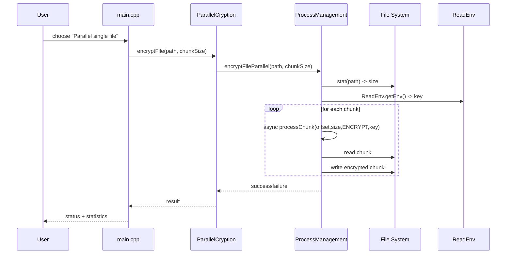
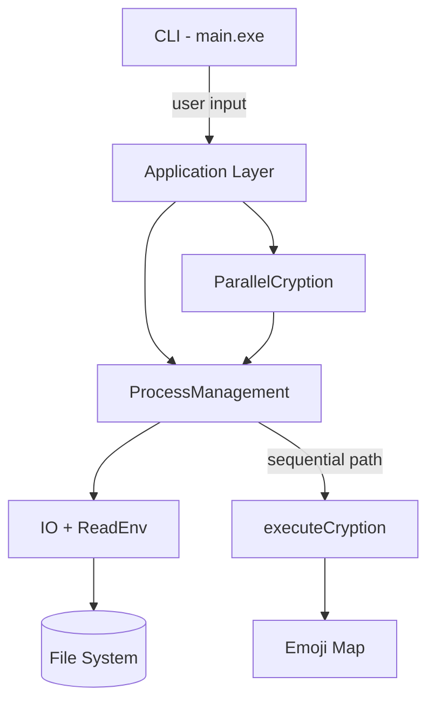

# File Encryptor – Architecture and Design

This document explains the system architecture, module responsibilities, control and data flows, parallelization strategy, and operational concerns for the File Encryptor project. Mermaid diagrams are included to visualize the structure and runtime behavior.

## Goals

- Provide a simple CLI to encrypt/decrypt files and directories.
- Offer both traditional (single-threaded) and parallel (multi-threaded) processing.
- Keep the code modular: IO, Task model, Process management (thread pool + chunking), and higher-level orchestration.

## High-level overview

- Entry points
  - `main.cpp` – interactive menu app that exposes traditional and parallel workflows.
  - `src/app/encryptDecrypt/ParallelCryptionDemo.cpp` – self-contained demo/comparison runner.
  - `src/app/encryptDecrypt/CryptionMain.cpp` – minimal driver for `executeCryption` (primarily for testing).
- Core modules
  - IO: `IO.hpp/cpp`, `ReadENV.cpp`
  - Process: `Task.hpp`, `ProcessManagement.hpp/cpp`
  - Encryption: `Cryption.hpp/cpp`, `ParallelCryption.hpp/cpp`
- Build tooling
  - `makefile`, `build.ps1`, `build.bat`
- Config/secrets
  - `.env` – contains the numeric key (as text) used by the toy cipher.

## Data model and contracts

- Task

  - Inputs: file path (string), action (ENCRYPT|DECRYPT), and an fstream opened by IO.
  - Serialization: `Task::toString()` format: `"<path>,<ENCRYPT|DECRYPT>"`.
  - Deserialization: `Task::fromString(taskData)` parses the same format, reopens the fstream via IO.
  - Error modes: invalid format, file open failure.

- Environment key (`ReadEnv`)

  - Reads `.env` via `IO` and returns its full contents as a string; the program then `stoi`s it to an `int`.
  - Error mode: `.env` not present or not parseable as int -> `stoi` will throw.

- IO
  - `IO(file_path)` opens the file as `ios::in | ios::out | ios::binary`.
  - `getFileStream()` returns the fstream by move; ownership is transferred to `Task`.

## Sequential cryption (emoji-based)

`executeCryption` implements a character-shift cipher where each resulting byte index (0–255) maps to an emoji. Decryption reverses the mapping by scanning the file as a string and matching emojis to indices.

Notes/implications:

- Encryption converts a binary/text file into a UTF-8 emoji stream. Size grows and positions no longer align with the original bytes.
- Decryption parses variable-length UTF-8 sequences. It linearly scans and matches to the reverse map.
- This approach is primarily demonstrative; parallel chunking is not compatible with the emoji format because chunk boundaries may cut inside a multi-byte emoji. For parallel processing, the system uses a byte-wise shift cipher in-place (see below).

## Parallel cryption (byte-shift, in-place)

To enable parallelism safely, `ProcessManagement` processes files in fixed-size byte chunks and applies a simple `(+key) % 256` (for ENCRYPT) or `(-key+256) % 256` (for DECRYPT) per byte. This preserves file length and allows chunks to be processed independently by multiple threads.

- `ParallelCryption`

  - Orchestrates file-, batch-, and directory-level operations.
  - Delegates chunked work to `ProcessManagement` which manages async tasks.
  - Tracks statistics (files/bytes/time) for reporting throughput.

- `ProcessManagement`
  - Initializes a pool of worker threads for the task-queue API.
  - Also exposes async helpers for per-file chunk processing (uses `std::async` for chunk tasks).
  - Splits the file into N chunks of `chunkSize`, creates futures, and waits for completion.

## Module responsibilities

```mermaid
flowchart LR
  A[main.cpp] -->|menu actions| B[ParallelCryption]
  A -->|traditional| C[ProcessManagement]
  B -->|encrypt/decrypt file/dir| C
  C -->|chunk work| F[(file on disk)]
  C -->|read key| D[ReadEnv]
  D -->|reads .env| E[IO]
  C -->|sequential cryption (queue)| G[executeCryption]
  G --> H[Emoji Map]
```

Key relationships:

- `ParallelCryption` is the high-level API for encrypting/decrypting files, sets, and directories.
- `ProcessManagement` owns worker threads and also provides chunked file processing used by `ParallelCryption`.
- `executeCryption` is used for the traditional queue-based path; it performs emoji mapping and re-writes the whole file.

## Runtime sequence – Parallel file encryption



## Concurrency model

- Worker threads: created in `ProcessManagement` ctor and used for queued `Task`s via `submitToQueue` + condition variable.
- Chunk parallelism: `processFileInChunks` uses `std::async(launch::async, ...)` per chunk; each chunk independently opens the file, reads/writes its region, and exits.
- Synchronization concerns: Each chunk uses its own fstream and writes to a disjoint range, so no shared state is mutated concurrently (besides the file). On some filesystems, concurrent writes to non-overlapping regions are safe; still, flushing is done per chunk.

## Error handling and edge cases

- Missing `.env` -> `stoi` throws; catch and report in callers (`ParallelCryption` prints errors).
- Non-existent file or empty file -> early return with message.
- Directory scanning errors -> caught/logged; processing continues where possible.
- Emoji mode limitations -> not chunk-safe; use traditional path for emoji cipher.
- Permission/lock errors when opening files -> chunk task returns false; aggregated result indicates partial failure.

## Build and run

- PowerShell: use `build.ps1` for best experience on Windows.
- GNU Make: `make` builds three targets: `encrypt_decrypt`, `cryption`, `parallel_demo`.
- Batch file: `build.bat` builds `encrypt_decrypt.exe` only.

## Mermaid – Containers (C4-ish)



## Known limitations and improvements

- Mixing emoji-based cryption with chunked in-place cryption produces incompatible formats. Prefer one mode per file lineage.
- Using `std::async` per chunk can incur overhead on very small chunk sizes; a work-stealing pool could improve throughput.
- `ReadEnv` reads the entire `.env` as a string; consider trimming whitespace and validating numeric format.
- `IO` currently exits the process on open failure; prefer exceptions for library-style reuse.
- `Task` owns an fstream and is serializable via string; this is convenient for the traditional queue but unnecessary for chunk paths.
- Consider temp-file approach for stronger crash-safety: write to `file.tmp`, then replace original on success.

## Security note

This project uses a toy cipher (simple byte shift and emoji mapping). It is not cryptographically secure and must not be used to protect sensitive data. If you need real security, integrate a proven library (e.g., libsodium/OpenSSL) with authenticated encryption (AEAD).
